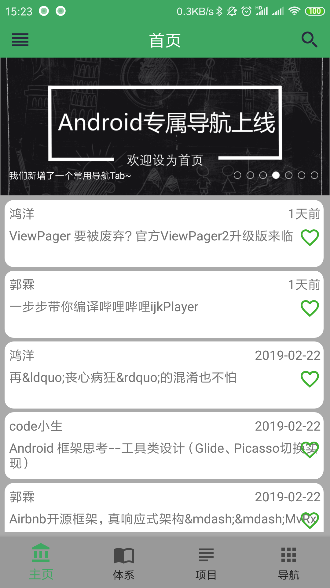
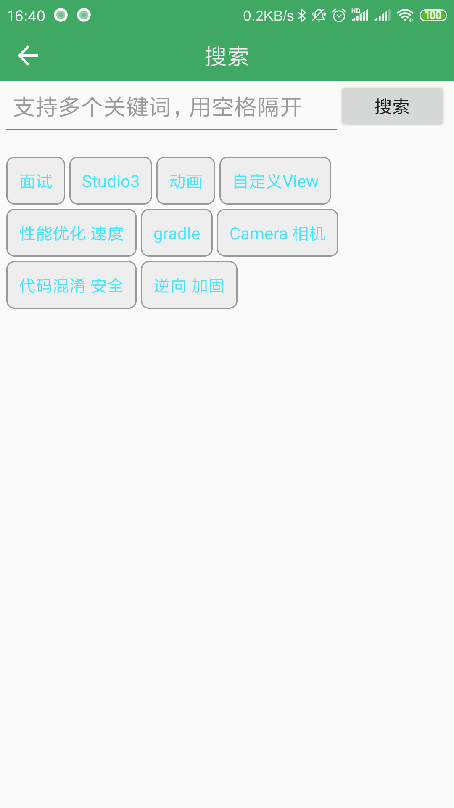
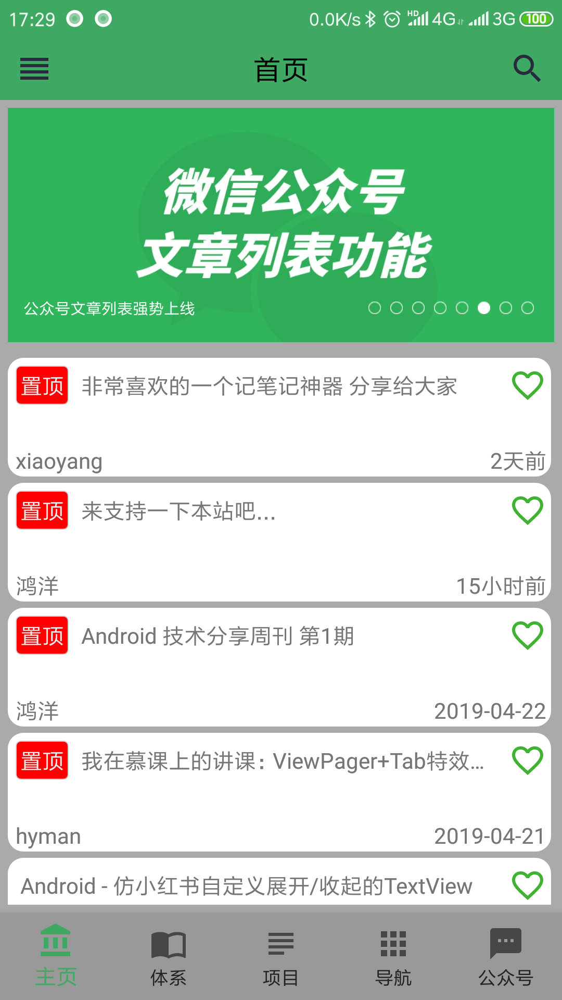
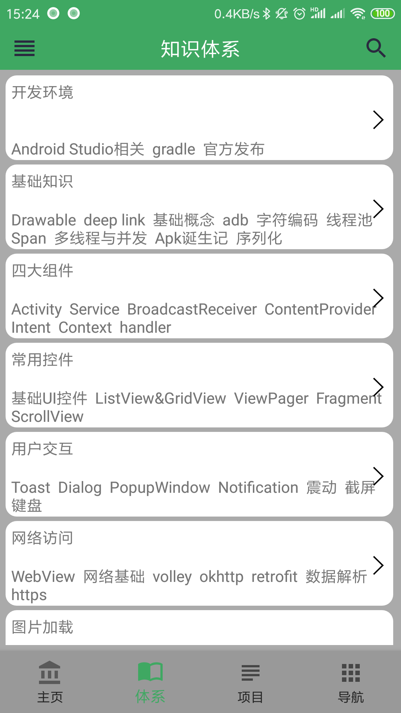
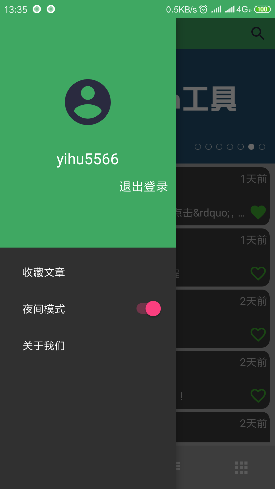
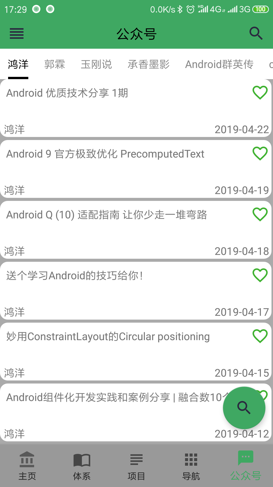
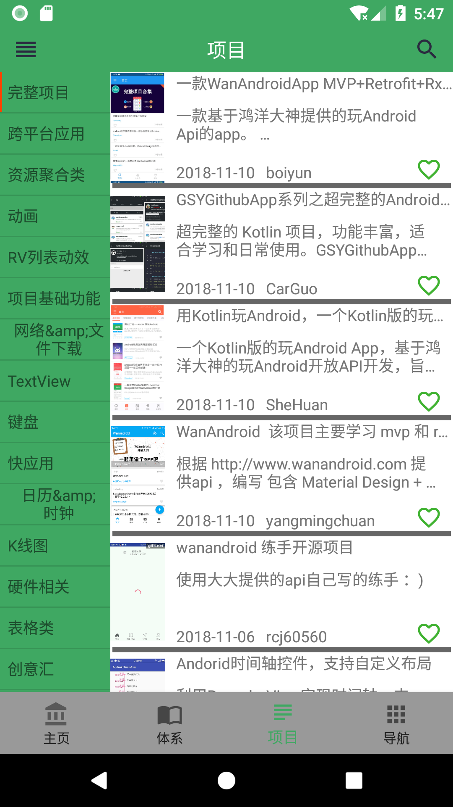
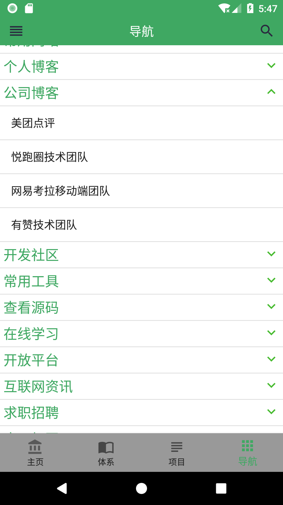

# wanadnroid

近期时间比较充裕，打算把kotlin在系统的学习学习，所以打算做一个开源的项目，

因为平时经常关顾洪洋的wanAndroid网站，然后刚好上面有完善的api提供，所以就就开始着手开发了，

项目已经完成一段时间了，忙了一小段时间，现在才出文章记录一下，

后续有精力会把功能继续完善上的。下面就简单介绍一下内容吧。

[项目的地址](https://github.com/yihu5566/wanadnroid)

**特此 感谢wanandroid提供的开放API，感谢开源三方库的作者。**

### 下面是我的博客地址，欢迎围观
[我的博客地址](https://blog.csdn.net/shayubuhuifei/article/details/87939344)

#### 主要功能

1.首页轮播图

2.首页列表

3.知识体系列表

4.用户登录注册

5.文章收藏

6.文章搜索

7.导航tab

8.项目tab

9.添加了夜间模式

框架部分主要使用了jessyan的arms，相对来讲这个框架还是比较重的，项目比较小的话可以用他的另外一个轻量版本。

框架内集成了大多数的主流框架，mvp、dagger2、Rxjava等具体可以参看如下链接

[框架](https://github.com/JessYanCoding/MVPArms/wiki)

因为这个项目的主要内容是为了学习kotlin的相关知识，所以架构这方面就没有自己来完成。

项目中涉及到的kotlin相关问题，我也做了一点记录，可以到我的博客去看一看。

#### 主要截图

    

    

    

    

<!---->

<!---->

<!---->

<!---->

