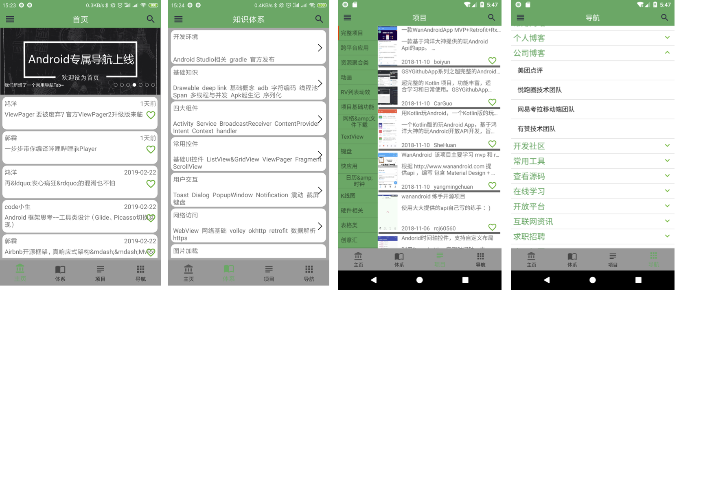

# wanadnroid

主要是根据wanAndroid网站的开放api来完成

其中使用的三方库是armmvp来完成,项目中大部分代码使用kotlin来完成

### 下面是我的博客地址，欢迎围观
[我的博客地址](https://blog.csdn.net/shayubuhuifei/article/details/87939344)

#### 主要功能

1.首页轮播图

2.首页列表

3.知识体系列表

4.用户登录注册

5.文章收藏

6.文章搜索

7.导航tab

8.项目tab

#### 主要截图

